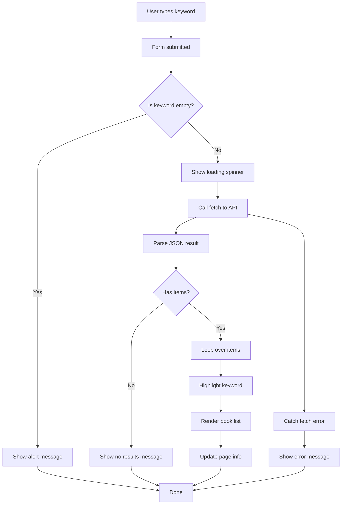

# 📚 책과 글자를 사랑하는 사람들을 위한 필픽(PhilPick)
 | 
--|--|


- [🌐 사이트 바로가기 (Vercel)](https://philpick.vercel.app/)
- [⚙️ Vercel Dashboard](https://vercel.com/kimsunghoons-projects/philpick)
- [📘 제작 과정 Notion](https://stump-smartphone-024.notion.site/OPEN-API-project-1bdf398452c3800a8164dc2b2c5aef6e?pvs=4)
- [🙋‍♂️ 발표 google slide](https://docs.google.com/presentation/d/1c7wPQL5Wge0kcsBs768rRh8-R0wuK5X76Vcwa-u0-7U/edit?usp=sharing)
---

## 🟩 주제 선정

- 알라딘 서재 Open API를 활용하여 나만의 서점을 만들어보자.
- 멀티미디어 중심의 시대 속에서, 책을 사랑하는 사람들은 자신의 철학을 중요시하는 경향이 있다.
- 철학(Philosophy)과 선택(pick)을 결합한 **PhilPick(필픽)**이라는 이름으로,
  **글자와 의미를 사랑하는 이들을 위한 심플한 서점**을 지향한다.
- **표지 이미지보다 텍스트에 집중할 수 있는 UI**를 제공한다.

---

## 🟨 설계

### 🏠 Home Page

- 별도의 랜딩 없이 곧바로 검색 및 리스트 페이지를 홈으로 사용.
- 최대한 **심플한 UI**로 구현해 사용자가 글과 정보를 중심으로 경험할 수 있도록 구성.

---

## 📋 코드 진행 순서 및 정리

- [01 입력 값 추출](https://www.notion.so/01-1cef398452c38025b57ac21141313f63?pvs=21)
- [02 API 키 발급 및 연결 확인](https://www.notion.so/02-API-1cef398452c380168920ee4cfb494c88?pvs=21)
- 03 응답 값으로 리스트 만들기
- 04 힌트 텍스트 추가
- [05 검색어 하이라이트 기능 추가](https://www.notion.so/05-1cef398452c380039ab6e6b9c37a6add?pvs=21)
- [06 Tailwind 적용](https://www.notion.so/06-tailwind-1cef398452c380cb8922c7c9c3f9b8ba?pvs=21)
- [07 웹 폰트 로딩 애니메이션](https://www.notion.so/07-1cef398452c380f9b533d9c71ea17e4d?pvs=21)
- [08 Tailwind 다크모드 라이브러리 적용](https://www.notion.so/08-tailwind-darkmode-library-1cef398452c380e4aec3e0c42f76c121?pvs=21)
- [09 검색 결과 페이지네이션](https://www.notion.so/09-1cef398452c3801f93d2cdadf7971ccd?pvs=21)
- [10 GitHub 연동 + Vercel Serverless 배포](https://www.notion.so/10-github-vercel-serverless-1cef398452c380f4b9f2d84733878d8e?pvs=21)

---

## 📁 폴더 구조

```
├── README.md
├── api
│   └── search.js
├── archive
│   ├── proxy-test.html
│   ├── index_temp.html
│   ├── style.css
│   ├── temp
│   │   ├── index_jq.html
│   │   └── index_js.html
│   └── test.html
├── img
│   ├── favicon.png
│   └── sample.png
├── index.html
├── output.css
├── package-lock.json
├── package.json
├── script.js
├── src
│   ├── darkmode.js
│   └── input.css
└── tailwind.config.js
```

## 책 검색 플로우맵



## 스크립트 코드

### searchBooks 함수

```javascript
// 📌 메인 검색 함수 (비동기 처리)
// async: 이 함수 내부에서 비동기 작업(await)을 사용할 수 있게 만듦
async function searchBooks(page = 1) {
  // 1. DOM 요소 가져오기
  const query = document.getElementById("searchInput").value.trim(); // 사용자가 입력한 검색어
  const resultContainer = document.getElementById("list");            // 검색 결과를 출력할 영역
  const resultCount = document.getElementById("resultCount");         // 결과 수 표시 영역
  const pagination = document.getElementById("pagination");           // 페이지네이션 UI
  const loading = document.getElementById("loading");                 // 로딩 애니메이션 요소

  // 2. 검색어가 비어있으면 경고창을 띄우고 함수 종료
  if (!query) {
    alert("검색어를 입력해주세요!");
    return;
  }

  // 3. 현재 페이지와 검색어를 저장
  currentPage = page;
  lastQuery = query;
  const startIndex = (page - 1) * resultsPerPage + 1; // API에서 사용할 시작 위치

  // 4. 로딩 표시 활성화
  if (loading) loading.classList.remove("hidden");

  // 5. API 호출 주소 구성 (Vercel 서버리스 함수 이용)
  const proxyUrl = `/api/search?query=${encodeURIComponent(query)}&page=${page}`;

  try {
    // ✅ 6. 데이터 요청 — fetch는 Promise를 반환하므로 await 사용
    const res = await fetch(proxyUrl); // 서버에 데이터 요청
    // ✅ 7. 응답 데이터를 JSON 형식으로 파싱
    const data = await res.json(); // 응답을 JSON 객체로 변환 (두 번째 await)
    // ✅ 8. 실제 콘텐츠는 allorigins로 감싸져 있으므로 내부 콘텐츠 파싱
    const parsed = JSON.parse(data.contents); // 최종적으로 책 데이터 추출

    // 9. 결과 초기화
    resultContainer.innerHTML = "";
    if (resultCount) resultCount.textContent = "검색결과 : 0건";

    // ❌ 10. 결과가 없는 경우 안내 메시지 출력
    if (!parsed.item || parsed.item.length === 0) {
      resultContainer.innerHTML = `<p id="hintText" class="text-hint">일치하는 검색 목록이 없습니다.</p>`;
      if (pagination) pagination.classList.add("hidden");
      return;
    }

    // ✅ 11. 총 결과 수 표시
    if (resultCount && parsed.totalResults !== undefined) {
      resultCount.textContent = `검색결과 : ${parsed.totalResults.toLocaleString()}건`;
    }

    // ✅ 12. 현재 페이지 / 전체 페이지 수 표시
    if (pageNumber) {
      const totalPages = Math.ceil(parsed.totalResults / resultsPerPage);
      pageNumber.textContent = `${currentPage} / ${totalPages}`;
    }

    // ✅ 13. 페이지네이션 UI 표시
    if (pagination) pagination.classList.remove("hidden");

    // 🔘 14. 이전 / 다음 버튼 비활성화 조건
    if (prevBtn) prevBtn.disabled = currentPage === 1;
    if (nextBtn) nextBtn.disabled = parsed.item.length < resultsPerPage;

    // ✅ 15. 결과 데이터 렌더링
    parsed.item.forEach((book) => {
      // 하이라이트 처리
      const title = highlightKeyword(book.title, query);
      const description = highlightKeyword(book.description || '', query);

      // HTML 템플릿 문자열 생성
      const itemHTML = `
        <div class="book-item">
          
          <div class="book-info">
            <span class="book-title">${title}</span>
            <span>저자: ${book.author}</span><br />
            <span>출판사: ${book.publisher}</span>
            <p class="book-desc">${description.substring(0, 100)}...</p>
            <span class="book-price">${book.priceStandard.toLocaleString()}원</span>
          </div>
        </div>
      `;

      // DOM에 삽입
      resultContainer.insertAdjacentHTML("beforeend", itemHTML);
    });

  } catch (error) {
    // ❗ 예외 발생 시 — 네트워크 문제 또는 API 오류
    console.error("에러 발생:", error);
    resultContainer.innerHTML = `<p class="hint-text text-red-500">검색 중 오류가 발생했습니다. 인터넷 연결 또는 API 서버 상태를 확인해주세요.</p>`;
    if (pagination) pagination.classList.add("hidden");
  } finally {
    // 🔄 로딩 애니메이션 숨기기 (성공/실패와 관계없이 항상 실행됨)
    if (loading) loading.classList.add("hidden");
  }
}
```

### AJAX code

```javascript
// 검색어와 페이지 정보를 기반으로 proxy API 주소 생성
const proxyUrl = `/api/search?query=${encodeURIComponent(query)}&page=${page}`;

try {
  // 📡 외부 Open API 호출 (Vercel의 서버리스 함수 사용)
  const res = await fetch(proxyUrl); // API 요청
  const data = await res.json();     // 응답을 JSON 형태로 변환
  const parsed = JSON.parse(data.contents); // 실제 API 결과 파싱
} catch (error) {
  console.error("에러 발생:", error); // 오류 발생 시 로그 출력
}
```


## 🛠️ To Do

### issue
- [ ] [검색 목록][페이지네이션] 페이지 3 번째 이후로 전환 시, 리스트 갱신 미동작 현상
- [ ] [검색] 검색된 리스트 존재하는 상태에서 null값 검색 후 [다음] [이전] 버튼 선택 시, 에러 얼럿 미노출 현상 (reload 필요)

### ver 0.2
- [ ] 검색 기준 드롭다운 추가 (제목, 저자 등 구분)
- [ ] 리스트 3단 필터 추가

### ver 0.3
- [ ] 방문기록 페이지
- [ ] 장바구니 기능
- [ ] 추천 도서 전면 배너 페이지

### ver 0.4
- [ ] Tailwind 표준에 맞게 클래스 수정 필요

---

## 🔗 Reference

- [알라딘 Open API 공식 문서](https://blog.aladin.co.kr/openapi/popup/5353304)
- [관련 기획안 문서 (Google Docs)](https://docs.google.com/document/d/1mX-WxuoGs8Hy-QalhHcvuV17n50uGI2Sg_GHofgiePE/edit?tab=t.0)
